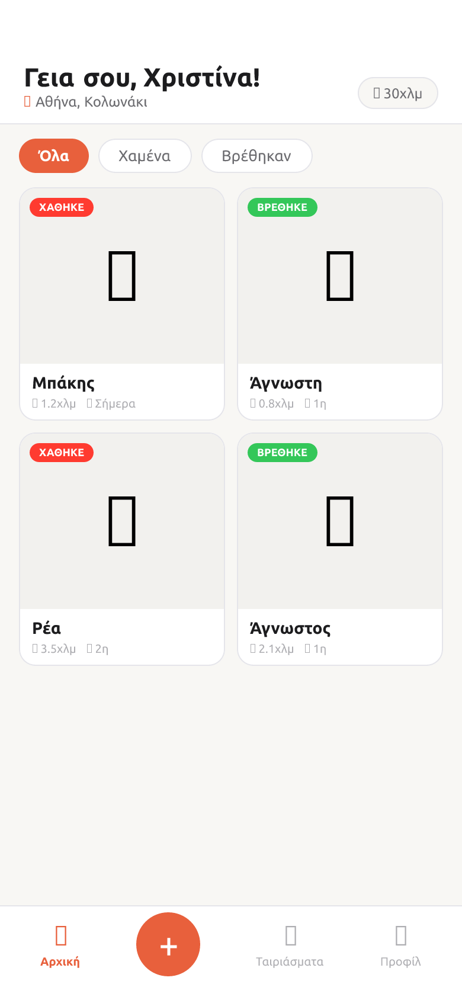
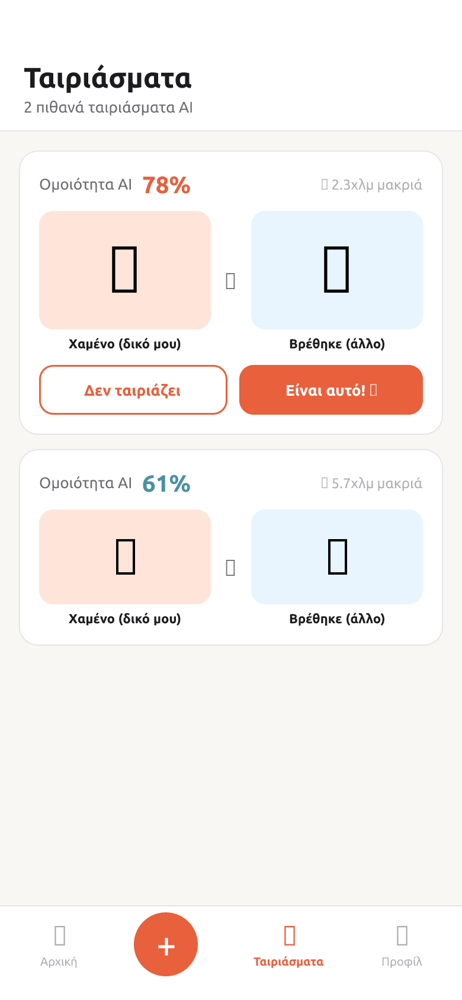
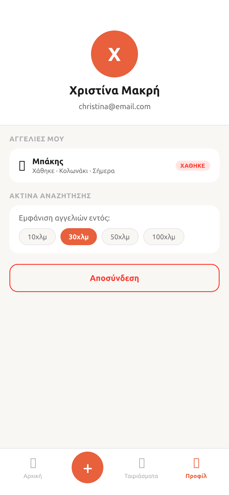

# TailTrail 🐾

**Free, open-source lost pet finder app for Greece**

Upload a photo and AI will find your pet — no fees, no ads.

<p align="center">
  
  
  
  
  
</p>

---

## How it works

1. **Lost a pet?** Upload a photo → AI searches for matches among found animals in your area
2. **Found a pet?** Upload a photo → AI searches among lost pets nearby
3. **Get notified** when a potential match is found — you confirm it

The system uses the **CLIP** model for visual photo similarity and **PostGIS** for geographic search within a configurable radius (10 / 30 / 50 / 100 km).

## Features

- **AI photo matching** — CLIP visual embeddings, no text description needed
- **Geographic search** — configurable radius, default 30 km
- **Location privacy** — only an approximate area is shown, not an exact address
- **Automatic photo moderation** + report button
- **Push notifications** for every new match
- **Sign in with Google / Apple**
- **GDPR compliant** — data is automatically deleted 7 days after a listing is closed
- **100% free** for users and for hosting (Supabase free tier + HuggingFace free API)

## Tech Stack

| Layer | Technology |
|---|---|
| Mobile | React Native + Expo SDK 56 (TypeScript) |
| Backend | Supabase (PostgreSQL + pgvector + PostGIS) |
| AI Matching | CLIP `openai/clip-vit-base-patch16-224` via HuggingFace |
| Auth | Supabase Auth — email / Google / Apple OAuth |
| Storage | Supabase Storage |
| Serverless | Supabase Edge Functions (Deno) |
| Notifications | Expo Push Notifications |

## Getting Started

### Prerequisites

- Node.js 18+
- [Supabase](https://supabase.com) account (free tier)
- [HuggingFace](https://huggingface.co) account (free tier)

### 1. Clone & install

```bash
git clone https://github.com/ChristinaMakri/tailtrail.git
cd tailtrail/app
npm install
```

### 2. Supabase — database

1. Create a new project at [supabase.com](https://supabase.com)
2. In the **SQL Editor**, run the following in order:
   - `supabase/migrations/001_initial.sql`
   - `supabase/migrations/002_find_similar_pets.sql`
3. Enable **Google** and **Apple** OAuth under Authentication → Providers

### 3. Supabase — Edge Functions

```bash
supabase functions deploy generate-embedding find-matches moderate-image
supabase secrets set HUGGINGFACE_TOKEN=hf_xxxxxxxxxxxxxxxx
```

### 4. Configuration

In `app/app.json` → `extra`, set your Supabase project URL and anon key:

```json
"extra": {
  "supabaseUrl": "https://your-project.supabase.co",
  "supabaseAnonKey": "your-anon-key"
}
```

### 5. Run

```bash
cd app
npm start
```

Scan the QR code with [Expo Go](https://expo.dev/go) (Android / iOS).

## Project Structure

```
tailtrail/
├── app/                          # React Native + Expo
│   ├── src/
│   │   ├── screens/
│   │   │   ├── auth/             # Welcome, Login, Register
│   │   │   ├── home/             # Feed + listing detail
│   │   │   ├── report/           # New report (lost / found)
│   │   │   ├── matches/          # AI matches
│   │   │   └── profile/          # Profile + my listings
│   │   ├── components/           # Reusable UI components
│   │   ├── navigation/           # React Navigation (stack + tabs)
│   │   ├── hooks/                # useAuth, usePets, useMatches
│   │   ├── lib/                  # Supabase client + design system
│   │   └── types/                # TypeScript interfaces
│   └── App.tsx
└── supabase/
    ├── migrations/
    │   ├── 001_initial.sql        # Tables, RLS, triggers
    │   └── 002_find_similar_pets.sql  # pgvector similarity function
    └── functions/
        ├── generate-embedding/    # CLIP embedding via HuggingFace
        ├── find-matches/          # Vector + PostGIS search
        └── moderate-image/        # Automatic content moderation
```

## Roadmap

### AI & Matching
- [ ] **Fine-tuned pet re-identification model** — replace CLIP with a domain-specific model (e.g. OSNet) trained on pet images for significantly better accuracy, especially across lighting conditions and angles
- [ ] **Multi-signal scoring** — combine visual embedding similarity with structured metadata (species, breed, colour, size) as a secondary signal to reduce false positives

### UX & Onboarding
- [ ] **Guided onboarding** — 2–3 slide walkthrough for new users explaining the AI matching flow
- [ ] **Deep links from push notifications** — tap a match notification and land directly on the match card, not the home feed
- [ ] **Map view** — optional map showing approximate locations of nearby reports

### Trust & Safety
- [ ] **Verified reunions** — let users confirm a successful match; show reunion count on the home screen to build community trust
- [ ] **Location blur** — replace approximate area text with a hexagon-grid overlay on a map so the general zone is visible without revealing the exact street
- [ ] **Breed / colour auto-detection** — pre-fill the report form using the uploaded photo so users don't have to type manually

### Technical
- [ ] **Async embedding pipeline** — move CLIP inference to a background queue so the user doesn't wait on HuggingFace API latency after uploading
- [ ] **Embedding cache** — skip re-computation when the same image is re-uploaded
- [ ] **Rate limiting** on Edge Functions to prevent abuse
- [ ] **Expo EAS Build** — set up cloud builds for distributing test builds via TestFlight / Google Play Internal Testing

### Discovery
- [ ] **Landing page** — simple web page so people can find the app without knowing GitHub
- [ ] **iOS & Android store listings** — publish to App Store and Google Play

## License

MIT — free to use, modify, and distribute.
